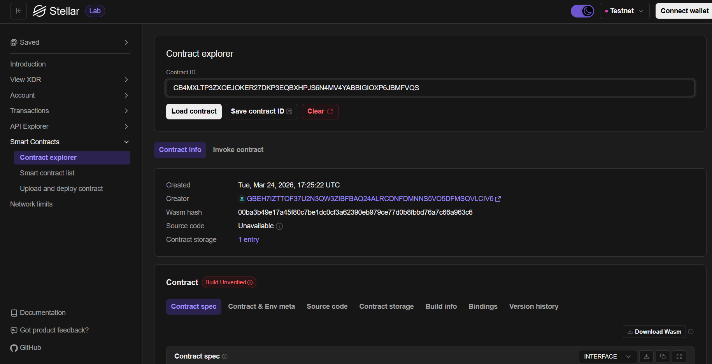

# Mini Student Reward 🎓

A fully functional, decentralized Web3 application built on the Stellar Soroban blockchain. This dApp allows teachers to securely reward students with native XLM, featuring a clean frontend and an optimized Rust smart contract.

## Deployment Details

*   **Contract ID:** `CB4MXLTP3ZXOEJOKER27DKP3EQBXHPJS6N4MV4YABBIGIOXP6JBMFVQS`
*   **Alias:** `mini_reward`
*   **Network:** Stellar Testnet

## Dashboard Preview


## Stellar Labs



## Features ✨

*   **Non-Custodial Wallet Integration:** Securely connect and sign transactions using the [Freighter Browser Extension](https://www.freighter.app/).
*   **On-Chain Rewards:** The smart contract allows authorized teachers to transfer tokens to students seamlessly.
*   **Real-time Ledger Interaction:** View account balances and interact with the deployed contract in real time.
*   **Storage Optimized:** Utilizes Soroban's state management to securely store configuration.
*   **Clean UI:** A responsive frontend built with vanilla HTML/JS mimicking a modern dashboard.

## Project Architecture 🏗️

The project is divided into two main components:

1.  **Smart Contract (`/contracts/mini_reward`)**: Written in Rust using the Soroban SDK (v25.3.0). It handles the core logic and token transfers.
2.  **Frontend (`/frontend`)**: A lightweight HTML/JS Web3 application that interfaces with the deployed contract on the Soroban Testnet.

---

## Getting Started 🚀

### Prerequisites

*   [Node.js](https://nodejs.org/) (v18+) or Python for serving static files
*   [Rust](https://www.rust-lang.org/) (v1.94+)
*   [Stellar CLI](https://developers.stellar.org/docs/build/smart-contracts/getting-started/setup)
*   [Freighter Wallet Extension](https://www.freighter.app/)

### 1. Smart Contract

The contract is already deployed to the Stellar Testnet. If you wish to interact or deploy it yourself:

1. Build the contract:
   ```bash
   stellar contract build
   ```
2. Run unit tests to verify contract logic:
   ```bash
   cargo test
   ```
3. Deploy the contract using the included script (you must have a funded Stellar testnet account):
   ```bash
   bash deploy.sh
   ```

### 2. Frontend Application

The frontend uses `@stellar/stellar-sdk` and `@stellar/freighter-api` to connect to the deployed contract.

1. Navigate to the frontend directory:
   ```bash
   cd frontend
   ```
2. Start the local server:
   ```bash
   python -m http.server 8081
   ```
3. Open your browser to `http://localhost:8081`.

### Connecting your Wallet

1. Install the Freighter extension.
2. Switch the Freighter network to **Testnet**.
3. Fund your Freighter wallet using the [Stellar Laboratory Friendbot](https://laboratory.stellar.org/#account-creator?network=test).
4. Click **Connect Freighter** in the top right corner of the dApp.
